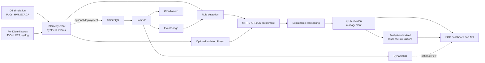

# SentinelOT

**A safe, local-first security operations lab for simulated OT/ICS environments.** SentinelOT generates synthetic industrial telemetry, detects suspicious behavior, enriches supported findings with MITRE ATT&CK, scores risk, groups findings into incidents, and presents the investigation workflow in a SOC dashboard.

It is designed to demonstrate how OT security monitoring components fit together without connecting to or changing real industrial systems.

## The problem

Operational technology environments combine long-lived controllers, supervisory systems, operator activity, and network security controls. Security teams need to connect events across those layers while preserving the context analysts need to investigate. SentinelOT models a small Purdue-style lab and a repeatable security workflow so these design ideas can be explored safely and locally.

## Architecture and data flow



The local path uses synthetic telemetry and SQLite. FortiGate logs enter through a local parser/normalizer. ML is opt-in and runs beside deterministic rules. The AWS CDK stack is a separate optional deployment path; local operation and tests do not need AWS credentials or live AWS resources. See [docs/architecture.md](docs/architecture.md) for component boundaries and [docs/demo.md](docs/demo.md) for a guided run.

## Capabilities

- **OT simulation and telemetry:** reproducible synthetic events for PLC, HMI, SCADA, and engineering assets using the shared `TelemetryEvent` schema.
- **Detection:** deterministic rules for network reconnaissance, authentication brute force, unauthorized PLC access, PLC command frequency, insider behavior, FortiGate IPS alerts, and FortiGate denied-traffic bursts. Thresholds and evidence are documented in [docs/detection-engine.md](docs/detection-engine.md).
- **MITRE ATT&CK:** supported mappings are attached to alerts with tactic/technique metadata. Unsupported evidence remains explicitly unmapped. See [docs/mitre-mapping.md](docs/mitre-mapping.md).
- **Risk engine:** separate, explainable `RiskAssessment` values score severity, confidence, asset criticality, evidence, and mapping. See [docs/risk-model.md](docs/risk-model.md).
- **Incident management:** correlate and persist findings with SQLite; retain evidence references, analyst notes, timeline, status changes, and audit records.
- **SOC dashboard:** local React/TypeScript views for events, alerts, assets, MITRE, incidents, and investigation. The loopback API reuses backend models and services.
- **FortiGate telemetry:** parse synthetic JSON, CEF, and syslog-style records and normalize them into the shared event pipeline. No appliance or FortiGate credentials are used. See [docs/fortigate-integration.md](docs/fortigate-integration.md).
- **Optional AWS pipeline:** CDK-managed SQS, Lambda, EventBridge, CloudWatch, and DynamoDB with retry/DLQ handling. Tests use local synthesis and mocks. See [docs/aws-security-telemetry.md](docs/aws-security-telemetry.md).
- **Optional ML anomaly detection:** reproducible Isolation Forest features for command frequency and source/target behavior; findings join the existing alert pipeline with feature evidence. See [docs/ml-anomaly-detection.md](docs/ml-anomaly-detection.md).
- **Safe incident response:** analyst-requested and separately authorized simulations for host isolation, account disablement, PLC access blocking, and evidence references. No action changes a system and detection never triggers one. See [docs/incident-response.md](docs/incident-response.md).

## Safety model

Everything in the default workflow is synthetic and local. The simulators create event records; they do not send attack traffic, attempt logins, issue real PLC commands, or contact an external OT environment. The FortiGate integration consumes bundled fixtures. AWS deployment is opt-in and is not needed for the local demo. Response playbooks only write simulated action, timeline, and audit records; they never invoke OS, firewall, account, network, or PLC controls. There is no automated destructive response. More detail is in [docs/security-model.md](docs/security-model.md).

## Prerequisites

- Python 3.10 or newer
- Node.js 20 or newer and npm
- Git
- AWS credentials are **not** needed for local use or tests

The ML demo additionally installs scikit-learn. CDK synthesis additionally installs the optional AWS pipeline dependencies. Neither is needed to run the core telemetry or dashboard.

## Local setup

From the repository root, create and activate an environment, then install the core/test and optional ML dependencies:

```powershell
python -m venv .venv
.venv\Scripts\Activate.ps1
python -m pip install --upgrade pip
python -m pip install "pydantic>=2,<3" "pytest>=8,<10" "scikit-learn>=1.6,<2"
cd dashboard
npm ci
cd ..
```

On macOS/Linux, activate with `source .venv/bin/activate`; on Windows PowerShell use the command above. Python commands below use `python` after activation. `requirements-dev.txt` also includes the optional ML/CDK dependencies so every local validation can run from one environment. To install just the core dashboard/API dependencies use `python -m pip install "pydantic>=2,<3"`, adding pytest or optional packages only when needed.

## Quick demo

Generate a deterministic simulation report:

```powershell
python -m incident_management demo network_recon --seed 7 --db .sentinelot-demo.sqlite3
```

Start the API and dashboard in separate terminals from the repository root:

```powershell
# Terminal 1: API binds to loopback only
python -m dashboard_api --db .sentinelot-demo.sqlite3 --port 8000
```

```powershell
# Terminal 2
cd dashboard
npm run dev
```

Open the local Vite URL (normally `http://127.0.0.1:5173`), select the incident, and review its alerts, risk factors, ATT&CK context, timeline, and audit history. The dashboard's investigation view also supports the separately authorized response simulations. A complete walkthrough, including FortiGate and optional ML demos, is in [docs/demo.md](docs/demo.md).

## Validation

Run the full Python suite and frontend checks from the repository root:

```powershell
python -m pytest tests/unit -q
cd dashboard
npm test
npm run build
cd ..
```

Validate the optional AWS stack without deploying it:

```powershell
python -m pip install -r aws_pipeline/requirements.txt
python aws_pipeline/app.py
```

CDK synthesis writes templates under `aws_pipeline/cdk.out`; it does not create cloud resources. Then check whitespace and inspect the final changes:

```powershell
git diff --check
git status --short
```

## Documentation

- [Architecture](docs/architecture.md)
- [Demo walkthrough](docs/demo.md)
- [Security model and limitations](docs/security-model.md)
- [Detection rules](docs/detection-engine.md)
- [MITRE ATT&CK mapping](docs/mitre-mapping.md)
- [Risk model](docs/risk-model.md)
- [Incident management](docs/incident-management.md)
- [FortiGate integration](docs/fortigate-integration.md)
- [AWS security telemetry](docs/aws-security-telemetry.md)
- [ML anomaly detection](docs/ml-anomaly-detection.md)
- [Safe incident response](docs/incident-response.md)
- [Portfolio and interview notes](docs/portfolio.md)
