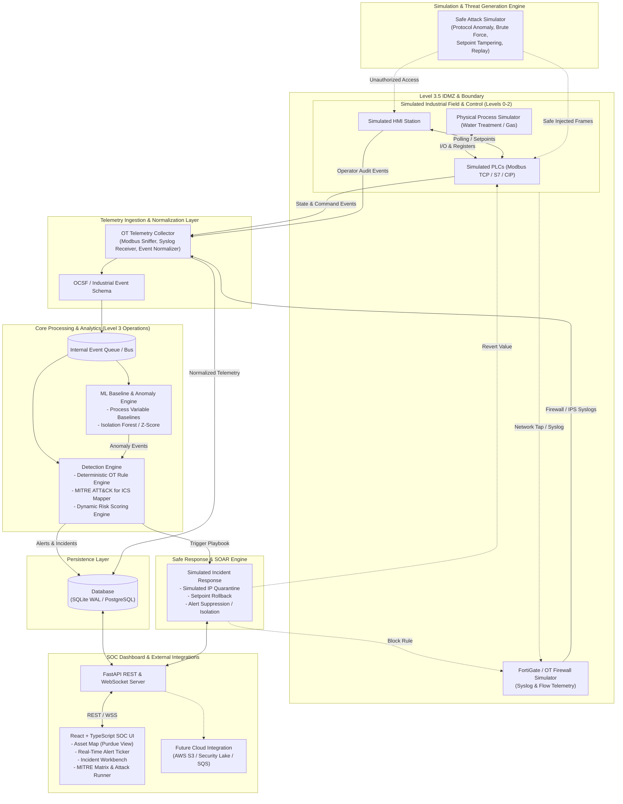
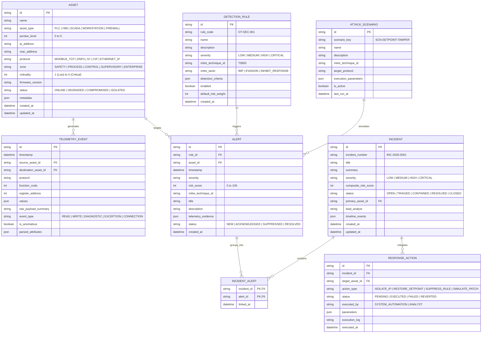

# SentinelOT — Industrial/OT Security Operations Platform
## Architecture & Technical Design Document

---

### 1. Executive Summary & Mission

**SentinelOT** is an isolated, defensive Operational Technology (OT) and Industrial Control System (ICS) Security Operations Center (SOC) platform. Its primary purpose is to provide end-to-end security visibility, telemetry normalization, anomaly detection, incident response, and risk assessment across simulated industrial environments without introducing operational hazard, malware, or unsafe exploit payloads.

The platform simulates Level 0 through Level 3 assets based on the Purdue Enterprise Reference Architecture (PERA / ISA-95), ingests operational and security telemetry, applies rule-based and statistical anomaly detections mapped to MITRE ATT&CK for ICS, and surfaces actionable security workflows on an industrial SOC dashboard.

---

### 2. Purdue Enterprise Reference Architecture (ISA-95) Alignment

SentinelOT models and monitors an industrial hierarchy partitioned into distinct trust zones:

```
+-------------------------------------------------------------------+
|  Enterprise Zone (Level 4 & 5)                                    |
|  - Corporate IT Network, Business Applications, Cloud Uplink     |
|  - SOC Dashboard, Central Threat Intelligence, AWS S3 Archive     |
+---------------------------------+---------------------------------+
                                  | Industrial Demilitarized Zone (IDMZ / Level 3.5)
                                  | - FortiGate Next-Gen Firewall / OT Deep Packet Inspection
                                  | - Data Diode / Syslog Proxy / SentinelOT Telemetry Collector
+---------------------------------+---------------------------------+
|  Manufacturing Operations & Control (Level 3)                     |
|  - SCADA Central Servers, Historians, Engineering Workstations    |
|  - SentinelOT Detection Engine & Incident Response Service        |
+---------------------------------+---------------------------------+
|  Area Supervisory Control (Level 2)                               |
|  - Human-Machine Interfaces (HMIs), Supervisory PLCs              |
+---------------------------------+---------------------------------+
|  Direct Control (Level 1)                                         |
|  - Programmable Logic Controllers (PLCs), Remote Terminal Units    |
|  - Safety Instrumented Systems (SIS)                              |
+---------------------------------+---------------------------------+
|  Physical Process (Level 0)                                       |
|  - Sensors, Actuators, Valves, Pumps, Thermal/Pressure Transducers|
+-------------------------------------------------------------------+
```

---

### 3. System Architecture Diagram



---

### 4. Component Responsibilities

| Component Directory | Service Name | Technical Responsibility |
|---|---|---|
| `telemetry/` | **OT Asset & Telemetry Simulator** | Runs simulated industrial assets (Modbus TCP server/PLC, HMI client, process physics loop). Generates benign baseline operational data and normalizes all wire-level frames and logs into standard OCSF JSON records. |
| `attack-simulator/` | **Safe Attack Simulator** | Orchestrates scripted, harmless cyberattack scenarios (unauthorized register writes, setpoint violations, rapid command bursts, HMI credential brute-force, unauthorized engineering station access). |
| `detection-engine/` | **Detection & Correlation Engine** | Evaluates normalized event stream against deterministic OT security rules, protocol compliance validators, and MITRE ATT&CK for ICS mappings; calculates composite risk scores and correlates related alerts into Incidents. |
| `ml/` | **Process Baseline & Anomaly Detector** | Maintains moving statistical baselines (mean, variance, Z-score, Isolation Forest) of analog process variables (pressure, flow, level, temperature) to detect stealthy physics tampering (Stuxnet-style out-of-bounds variations). |
| `incident-response/` | **Safe SOAR Engine** | Provides incident lifecycle state machine (Open -> Triage -> Contained -> Resolved) and executes safe simulated mitigation playbooks (simulated firewall drop, automated setpoint restoration, device isolation). |
| `threat-intelligence/` | **ICS Threat Intel Provider** | Curates known rogue engineering MACs, adversary IP signatures, known vulnerable PLC firmware versions, and threat actor profiles (e.g., Sandworm, Volt Typhoon, Dragos threat groups). |
| `fortigate/` | **FortiGate Telemetry Adapter** | Ingests and parses simulated FortiOS syslog streams, extracting OT application control hits, IPS signatures, and firewall deny logs into normalized events. |
| `dashboard/` | **SOC Console (Web UI)** | Modern, mission-critical React + TypeScript operator interface offering live Purdue hierarchy asset topology, real-time alert streams, MITRE ATT&CK heatmaps, incident investigation canvas, and attack simulation trigger console. |
| `infrastructure/` | **Deployment & Network Isolation** | Docker Compose definitions, container network topologies separating OT cell from enterprise SOC, environment configurations, and database migrations. |

---

### 5. Technology Choices & Rationale

#### 5.1 Backend: Python 3.12 + FastAPI + Pydantic v2
- **Why Python**: Unrivaled ecosystem for cybersecurity, OT protocol parsing (`pymodbus`, `scapy`), statistical analysis, and rapid rule formulation.
- **Why FastAPI & Pydantic v2**: High throughput asynchronous I/O (`asyncio`), native schema validation, automatic OpenAPI / Swagger generation, and sub-millisecond serialization performance essential for telemetry streaming.

#### 5.2 Frontend: React 18+ / TypeScript / Vite / Tailwind CSS
- **Why React + TypeScript**: Strong compile-time typing guarantees reliability for complex state operations (incident tracking, live telemetry grids).
- **Why Vite**: Instant HMR, lightweight bundle size, modern ESM pipeline.
- **Why Tailwind CSS + Lucide Icons**: Rapid development of a clean, responsive, dark-mode cybersecurity analyst workstation interface without bulky UI library overhead.

#### 5.3 Database: SQLite (Development Default) with PostgreSQL Compatibility via SQLAlchemy 2.0
- **Why SQLite with WAL (Write-Ahead Logging)**: Zero-configuration local startup for development and portfolio evaluation; robust single-file storage with high concurrent read performance.
- **Why SQLAlchemy 2.0 + Alembic**: Fully decouples the data layer. Switching to production-grade PostgreSQL in `docker-compose.yml` requires only setting an environment variable (`DATABASE_URL=postgresql+asyncpg://...`), preserving identical models and queries.

#### 5.4 Industrial Event Schema: OCSF / ECS-Adapted OT Standard
All events adhere to a unified JSON schema combining the Open Cybersecurity Schema Framework (OCSF) with industrial extensions (Purdue level, Unit ID, Modbus Function Code, Register/Coil Address, Process Variable delta).

---

### 6. Data Ingestion & Event Processing Pipeline

```
1. Physical Process Simulation
   - Updates synthetic physical variables (e.g., Tank Level 0-100%, Water Pressure 0-10 bar).
   - Writes values to Simulated PLC Holding Registers.

2. Polling & Network Activity
   - Simulated HMI polls PLC registers via Modbus TCP (Function Code 03).
   - Normal industrial traffic generated continuously at configurable intervals (1-5 Hz).

3. Telemetry Interception & Normalization
   - Collector captures frame metadata (Timestamp, Source IP/Port, Dest IP/Port, Protocol, Function Code, Register Address, Values).
   - Enriches event with Asset Inventory data (Asset Name, Purdue Level, Zone).
   - Outputs normalized `IndustrialSecurityEvent` object.

4. Detection Processing
   - Deterministic Rule Engine checks conditions:
     * Unauthorized Function Code (e.g., FC 08 Diagnostics, FC 43 Read Device ID from untrusted IP).
     * Out-of-Bounds Register Write (e.g., Pressure threshold > 8.5 bar).
     * High-frequency command bursts (Scan / DoS).
     * Unknown Source MAC/IP sending control commands.
   - Anomaly Engine checks:
     * Process variable rate-of-change deviations.
   - FortiGate parser correlates:
     * Matching firewall drop or IPS alarm within correlation time window (default: 60s).

5. Risk Scoring & Incident Aggregation
   - Evaluates Composite Risk Score:
     Risk = Base_Severity x Asset_Criticality x Threat_Confidence x Exposure_Factor
   - If risk exceeds threshold (> 70) or matching active incident exists, links or spawns an `Incident`.
   - Maps event to MITRE ATT&CK for ICS Technique (e.g., T0855 Unauthorized Command Message).

6. Alert & Incident Dispatch
   - Broadcasts event to frontend via WebSocket.
   - Dispatches automated response playbook if policy allows.
```

---

### 7. Database Entities & Schema Definition



---

### 8. API Boundaries & REST Service Contracts

The platform exposes clean REST endpoints and a real-time WebSocket channel:

#### 8.1 Asset Inventory API (`/api/v1/assets`)
- `GET /api/v1/assets` — List all registered OT/ICS assets with filtering (Purdue level, status, zone).
- `GET /api/v1/assets/{id}` — Detailed asset profile with live register status and historical alerts.
- `POST /api/v1/assets` — Register a new simulated asset.
- `PATCH /api/v1/assets/{id}` — Update asset configuration or isolation state.

#### 8.2 Telemetry & Process API (`/api/v1/telemetry`)
- `GET /api/v1/telemetry/live` — Fetch latest snapshot of physical process parameters and PLC registers.
- `GET /api/v1/telemetry/history` — Query time-series telemetry events for trend inspection.
- `POST /api/v1/telemetry/ingest` — Ingestion endpoint for external or collector-fed normalized events.

#### 8.3 Attack Simulation API (`/api/v1/simulation`)
- `GET /api/v1/simulation/scenarios` — Catalog of available safe simulation scenarios.
- `POST /api/v1/simulation/scenarios/{id}/launch` — Trigger execution of a safe attack simulation.
- `POST /api/v1/simulation/stop` — Immediately halt all active simulations and reset process state.
- `GET /api/v1/simulation/status` — Current status of running scenarios.

#### 8.4 Detection & Alerting API (`/api/v1/detections`)
- `GET /api/v1/detections/rules` — List all active detection rules with MITRE mappings.
- `POST /api/v1/detections/rules` — Create or update detection logic.
- `GET /api/v1/detections/alerts` — Retrieve alerts with pagination, severity filtering, and asset grouping.
- `PATCH /api/v1/detections/alerts/{id}` — Acknowledge or reclassify alert.

#### 8.5 Incident Management API (`/api/v1/incidents`)
- `GET /api/v1/incidents` — List all incidents with composite risk scores and lifecycle states.
- `GET /api/v1/incidents/{id}` — Full incident view with linked alerts, timeline, and audit logs.
- `POST /api/v1/incidents` — Manually escalate or create an incident.
- `PATCH /api/v1/incidents/{id}` — Update status (`TRIAGED`, `CONTAINED`, `RESOLVED`).

#### 8.6 Incident Response / SOAR API (`/api/v1/response`)
- `GET /api/v1/response/actions` — History of simulated mitigation actions.
- `POST /api/v1/response/execute` — Execute a safe response playbook (e.g., reset setpoint, isolate IP).
- `POST /api/v1/response/rollback` — Safely undo a simulated mitigation action.

#### 8.7 Real-Time Push Channel (`/api/v1/ws`)
- `GET /api/v1/ws/soc` — Bi-directional WebSocket streaming live alerts, process parameter deltas, simulation execution status, and incident updates.

---

### 9. MITRE ATT&CK for ICS Alignment Matrix

The platform maps detections and simulated attacks explicitly to the MITRE ATT&CK for ICS framework:

| MITRE ID | Technique Name | Tactic | Safe Simulation Method | Detection Logic |
|---|---|---|---|---|
| **T0855** | Unauthorized Command Message | Impair Process Control | Attacker scripts an unauthorized write (FC 06/16) to PLC critical registers from an unapproved IP. | Rule flags write commands originating from IP outside authorized Engineering/HMI IP allowlist. |
| **T0836** | Modify Parameter | Impair Process Control | Write command shifts chemical dosing or pump pressure beyond safe operating envelope (e.g. >90%). | Bounds-checker flags register value exceeding process safety upper limit (PSUL). |
| **T0814** | Denial of Service | Inhibit Response Function | Rapid flood of Modbus connection requests or malformed transaction frames directed at PLC port 502. | Rate limiter / burst detector flags >50 packets/sec or uncompleted handshakes. |
| **T0886** | Remote Services (Brute Force) | Lateral Movement / Initial Access | Simulated credential guessing attempts against HMI operator portal / web interface. | Syslog/Auth monitor detects >=5 failed attempts within 30 seconds from single source. |
| **T0843** | Program Download | Inhibit Response Function | Unauthorized invocation of diagnostic function codes (FC 08) or PLC program block download commands. | Protocol parser detects restricted maintenance function codes during operational mode. |
| **T0884** | Connection Loss | Inhibit Response Function | Simulated link cut / network drop between Supervisory SCADA and remote PLC. | Heartbeat loss detector detects missed telemetry poll cycles (>3 missed cycles). |

---

### 10. Safety & Ethical Safeguards

1. **Self-Contained Mock Targets**: All network transactions occur exclusively over local loopback (`127.0.0.1`) or within isolated Docker internal bridge networks (`sentinel-ot-bridge`).
2. **Harmless Payloads**: Attack scenarios consist solely of benign protocol anomalies (e.g., writing valid integer `95` to register `40001` or sending rapid read requests). No binary exploits, shellcode, reverse shells, or real-world malware are used.
3. **No External Network Scans**: The simulator is hardcoded to reject target IP addresses outside the configured local lab subnet.
4. **Instant Emergency Reset**: A single API call (`/api/v1/simulation/stop`) resets all registers, terminates simulation routines, and restores the physical process simulation to baseline steady-state.
5. **No Dangerous Code or Persistence**: No real system persistence, registry modification, rootkit, or destructive actions exist anywhere in the codebase.

---

### 11. Security & Operational Hardening of the Platform

- **Environment-Driven Configuration**: No secrets, default passwords, or IP configurations are hardcoded. All settings load from `.env` via Pydantic `BaseSettings`.
- **Defensive Input Sanitization**: All incoming telemetry payloads and API requests are rigorously validated against strict Pydantic models.
- **Structured JSON Logging**: Standardized Python logging with structured JSON format (`timestamp`, `level`, `component`, `event`, `trace_id`) facilitating audit trails.
- **Least Privilege Network Separation**: When containerized, the simulated OT field network is placed in a separate Docker network from the SOC dashboard, routed strictly through the telemetry collector proxy.
