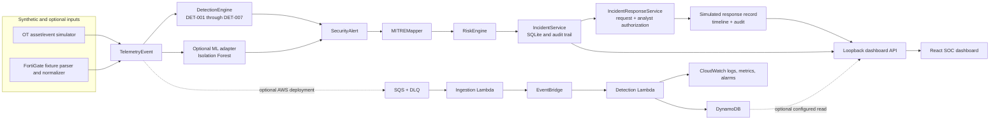

# SentinelOT architecture

SentinelOT is a local-first, modular OT security lab. Its primary pipeline uses one shared `TelemetryEvent` model and existing alert, risk, and incident models. Optional FortiGate, ML, and AWS adapters reuse these stages rather than defining a competing security workflow.

## End-to-end flow

## Component boundaries

| Component | Responsibility | Local behavior |
|---|---|---|
| `telemetry/` | Asset registry, baseline generator, and `TelemetryEvent`/asset schemas | Emits deterministic synthetic OT records |
| `attack_simulator/` | Creates attack-shaped scenarios as records | Does not send packets, authenticate, or issue real controller commands |
| `fortigate/` | Parses synthetic JSON, CEF, and syslog-style records and normalizes them | Uses checked-in fixtures; no FortiGate connection or credentials |
| `detection_engine/` | Applies deterministic rules and maps supported alerts to ATT&CK | Rule-based; unsupported mappings stay unmapped |
| `ml_detection/` | Extracts behavioral features, trains/scores an Isolation Forest, adapts findings to alerts | Optional dependency; fixed synthetic fixtures and reproducible seed |
| `risk_engine/` | Produces explainable `RiskAssessment` records | Separate from alerts and detection behavior |
| `incident_management/` | Correlates alerts and persists incident history in SQLite | Local DB, timeline, analyst notes, and audit records |
| `incident_response/` | Offers incident-derived simulated playbooks and state transitions | Explicit analyst request and authorization; no external side effects |
| `dashboard_api/`, `dashboard/` | Serves persisted SOC data and investigation controls | API binds to loopback; React client proxies local API |
| `aws_pipeline/` | Optional CDK stack and Lambda handlers for AWS telemetry ingestion/processing | Synthesis and tests run offline; deployment is a separate operator action |

## Local and AWS paths

The normal demo flows through the simulator, rules, ATT&CK mapper, risk engine, and SQLite incident service. The dashboard reads those local records. The FortiGate demo starts at parser fixtures and enters the same telemetry pipeline. The ML demo supplies a reviewed synthetic normal baseline and candidate records; ML is opt-in and does not change `DetectionEngine` defaults.

The optional AWS path is deployed independently. It accepts serialized telemetry through SQS, validates it in Lambda, routes it using EventBridge, runs existing detection/MITRE/risk components in a processing Lambda, and persists security records to DynamoDB. CloudWatch captures logs, metrics, and alarms. The existing API can read the AWS table when explicitly configured. Local operation has no AWS SDK client requirement and does not need AWS credentials. See [AWS deployment details](aws-security-telemetry.md).

## Persistence and trust boundaries

SQLite stores incidents and their response action, timeline, and audit history. Telemetry examples are generated locally and fixtures are synthetic. The AWS stack adds cloud persistence only after explicit deployment and configuration. Response records describe hypothetical outcomes only: success, failure, cancellation, and rollback simulations do not manipulate endpoints or industrial controls. See [security-model.md](security-model.md).
