# SentinelOT — Implementation & Development Plan

---

### 1. Overview & Phased Roadmap

This document outlines the phased engineering roadmap, directory structure, testing strategy, and local development setup for **SentinelOT**. The plan guarantees modular progress, clean separation of concerns, strict adherence to safety guidelines, and early validation of end-to-end functionality.

---

### 2. Project Directory Structure

```
SentinelOT/
├── attack-simulator/            # Safe attack scenario runners & traffic generators
│   ├── scenarios/               # Scripted safe attack modules (unauth write, DoS, brute force)
│   ├── engine.py                # Scenario orchestration and runner
│   └── cli.py                   # Standalone CLI runner for headless simulations
├── telemetry/                   # Industrial asset simulation & telemetry normalization
│   ├── assets/                  # Simulated PLC (Modbus TCP), HMI, and RTU services
│   ├── process/                 # Physical process simulation (Water Treatment / Pressure loop)
│   ├── collector/               # Packet sniffer / log collector & OCSF normalizer
│   └── schemas/                 # Pydantic models for OT events, registers, and protocols
├── detection-engine/            # Threat detection & correlation
│   ├── rules/                   # Deterministic OT security rules (YAML / Python definitions)
│   ├── engine.py                # Stream processor & rule evaluation engine
│   ├── correlation.py           # Multi-event correlation & incident grouper
│   ├── mitre_mapper.py          # MITRE ATT&CK for ICS taxonomy mapping
│   └── risk_calculator.py       # Composite risk score algorithm
├── incident-response/           # Safe SOAR & mitigation orchestration
│   ├── playbooks/               # Playbook definitions (quarantine, setpoint rollback)
│   ├── executor.py              # Safe mitigation dispatcher
│   └── state_machine.py         # Incident lifecycle tracker (Open -> Contained -> Closed)
├── threat-intelligence/         # OT threat intel & signature repository
│   ├── indicators/              # Known rogue MACs, adversary IP lists, vulnerable firmware
│   └── feed_manager.py          # Indicator matching engine
├── ml/                          # Process baseline modeling & statistical anomaly detection
│   ├── baseline.py              # Statistical baseline computation (EWMA, Z-score)
│   └── anomaly_detector.py      # Multi-variate anomaly detector (Isolation Forest / bounds)
├── fortigate/                   # FortiOS OT telemetry adapter
│   ├── syslog_receiver.py       # UDP/TCP Syslog listener & parser
│   └── parser.py                # FortiGate UTM / OT application control parser
├── dashboard/                   # React + TypeScript SOC Analyst Dashboard
│   ├── src/
│   │   ├── components/          # Reusable UI components (Purdue map, alert table, metric cards)
│   │   ├── pages/               # Views: Overview, Assets, Incidents, Attacks, Settings
│   │   ├── hooks/               # Custom hooks for WebSocket streaming & API fetching
│   │   ├── services/            # Axios / Fetch API client bindings
│   │   └── types/               # TypeScript interfaces matching backend Pydantic models
│   ├── package.json
│   └── vite.config.ts
├── infrastructure/              # Deployment, Docker, and environment configurations
│   ├── docker/                  # Dockerfiles for each modular service
│   ├── db/                      # Alembic migrations and database seeds
│   └── config.py                # Global Pydantic BaseSettings
├── tests/                       # Automated test suites
│   ├── unit/                    # Unit tests for rules, parsers, risk calculator, schemas
│   ├── integration/             # Pipeline integration tests (telemetry -> detection -> incident)
│   └── simulation/              # End-to-end attack simulation & alert verification tests
├── docs/                        # Architecture & operational guides
│   ├── architecture.md          # Technical design & Purdue model mapping
│   └── development-plan.md      # This implementation plan
├── docker-compose.yml           # Multi-container orchestration
├── README.md                    # Project overview, setup, and architecture summary
└── .env.example                 # Template for required environment variables
```

---

### 3. Phased Implementation Roadmap

```mermaid
flowchart LR
    Phase1["Phase 1: Foundation\n- Config & Schemas\n- DB Models & SQLite\n- Base FastAPI Service"]
    Phase2["Phase 2: Assets & Physics\n- Simulated Modbus PLC\n- Water Process Loop\n- Normal Polling HMI"]
    Phase3["Phase 3: Telemetry Pipeline\n- Ingestion Collector\n- OCSF Normalizer\n- WebSocket Stream"]
    Phase4["Phase 4: Attack Simulator\n- Safe Scenarios\n- Bounds Tampering\n- Command Floods"]
    Phase5["Phase 5: Detection Engine\n- ICS Rules Engine\n- MITRE ATT&CK Map\n- Risk Calculator"]
    Phase6["Phase 6: Incident & SOAR\n- Incident Lifecycle\n- Alert Correlation\n- Safe Playbooks"]
    Phase7["Phase 7: SOC Dashboard\n- React + TypeScript\n- Purdue Map View\n- Live Alert Canvas"]
    Phase8["Phase 8: FortiGate Adapter\n- Syslog Parser\n- OT IPS Mapping\n- Correlation"]
    Phase9["Phase 9: ML Anomaly\n- Physics Baselines\n- Drift Detection\n- E2E Validation"]

    Phase1 --> Phase2 --> Phase3 --> Phase4 --> Phase5 --> Phase6 --> Phase7 --> Phase8 --> Phase9
```



---

### 4. Detailed Phase Breakdown

#### Phase 1: Foundation & Core Data Models
- **Deliverables**:
  - Global configuration via `pydantic-settings` reading from `.env`.
  - Database layer via SQLAlchemy 2.0 with asynchronous engine (`aiosqlite` for local development, `asyncpg` ready for PostgreSQL).
  - Core ORM models: `Asset`, `TelemetryEvent`, `DetectionRule`, `Alert`, `Incident`, `IncidentAlert`, `ResponseAction`, `AttackScenario`.
  - Database initialization script with seed data (standard OT assets, Purdue levels, default detection rules).
  - FastAPI application skeleton with health check and API versioning (`/api/v1`).
- **Success Criteria**: `pytest tests/unit/test_db_models.py` passes; local SQLite database boots with pre-seeded assets.

#### Phase 2: Simulated OT Assets & Physical Process Loop
- **Deliverables**:
  - `telemetry/process/water_treatment.py`: Mathematical simulation of a multi-stage industrial water treatment process (Inflow Rate, Tank Level 0-100%, Chemical Dosing pH 6.5-8.5, Effluent Pressure 2.0-8.0 bar).
  - `telemetry/assets/plc_server.py`: Lightweight asynchronous Modbus TCP server (or memory-mapped register bank) hosting process holding registers and input coils.
  - `telemetry/assets/hmi_client.py`: Scheduled polling loop reading registers and occasionally writing setpoint adjustments within normal operating limits.
- **Success Criteria**: Process runs continuously in memory, registers update dynamically, and values remain within normal physical bounds under benign operation.

#### Phase 3: Telemetry Collection & Normalization Engine
- **Deliverables**:
  - `telemetry/collector/normalizer.py`: Transforms raw Modbus transactions and asset state changes into normalized `IndustrialSecurityEvent` records.
  - Normalized schema fields: `timestamp`, `event_id`, `source_ip`, `dest_ip`, `purdue_level`, `protocol`, `function_code`, `register`, `value`, `delta`, `is_normal_range`.
  - Ingestion REST endpoint (`POST /api/v1/telemetry/ingest`) and async in-memory ring buffer.
  - Real-time WebSocket broadcasting channel (`/api/v1/ws/soc`) broadcasting telemetry snapshots to connected clients.
- **Success Criteria**: Generated telemetry events are validated against the Pydantic schema and streamed without serialization bottlenecks.

#### Phase 4: Safe Attack Simulator
- **Deliverables**:
  - `attack-simulator/scenarios/unauthorized_write.py`: Simulates rogue IP issuing Modbus FC 06/16 command to overwrite Tank Drain Valve or Chemical Dosing setpoint.
  - `attack-simulator/scenarios/dos_flood.py`: Simulates high-frequency connection or polling flood targeting PLC port 502.
  - `attack-simulator/scenarios/hmi_brute_force.py`: Emulates repeated failed operator authentication attempts.
  - `attack-simulator/scenarios/out_of_bounds.py`: Injects physics setpoint exceeding safe physical limits (e.g., pressure set to 15.0 bar against an 8.0 bar limit).
  - API triggers (`POST /api/v1/simulation/scenarios/{id}/launch`) and an **Emergency Stop Switch** (`POST /api/v1/simulation/stop`).
- **Safety Assertions**: All scenarios target `127.0.0.1` exclusively. No executable payloads, shell commands, or network egress.
- **Success Criteria**: Running a scenario produces targeted telemetry anomalies and emits a completion report without destabilizing the application.

#### Phase 5: Detection Engine & MITRE ATT&CK for ICS
- **Deliverables**:
  - `detection-engine/engine.py`: High-performance deterministic rule matching engine evaluating normalized events against configurable rules:
    - `RULE-MODBUS-001`: Unauthorized Modbus Write (T0855).
    - `RULE-PHYSICS-002`: Process Safety Upper Limit Exceeded (T0836).
    - `RULE-BURST-003`: Command Request Flood / DoS (T0814).
    - `RULE-AUTH-004`: HMI Credential Brute-Force (T0886).
    - `RULE-ROGUE-005`: Unrecognized MAC/IP on Control Subnet (T0887).
  - `detection-engine/risk_calculator.py`: Evaluates composite risk score:
    $$\text{Risk Score} = \min\left(100, \; \text{Base Severity} \times 20 \times \frac{\text{Asset Criticality}}{5} \times \text{Confidence Multiplier}\right)$$
  - `detection-engine/correlation.py`: Groups related alerts targeting the same asset or occurring within a correlation window into unified `Incidents`.
- **Success Criteria**: Attack scenarios reliably trigger designated detection rules, generate alerts, calculate correct risk scores, and map to accurate MITRE ATT&CK for ICS technique IDs.

#### Phase 6: Incident Management & Safe Response Orchestration (SOAR)
- **Deliverables**:
  - Incident lifecycle state machine (`OPEN` -> `TRIAGED` -> `CONTAINED` -> `RESOLVED`).
  - Safe Playbook Executors:
    - **Simulated IP Isolation**: Appends rogue IP to simulated firewall blocklist and rejects subsequent packets.
    - **Setpoint Rollback**: Dispatches an authenticated corrective Modbus write restoring nominal setpoint (e.g., resetting pressure to 4.5 bar).
    - **Rule-Based Alert Suppression**: Temporarily silences non-critical noisy alerts during active incident triage.
  - Audit trail logging every playbook execution with timestamp, initiating actor, and pre/post register delta.
- **Success Criteria**: Triggering a setpoint tamper attack triggers an incident; analyst approves "Setpoint Rollback" response action; PLC register immediately returns to safe baseline.

#### Phase 7: Industrial SOC Dashboard (React + TypeScript)
- **Deliverables**:
  - Vite + React + TypeScript project in `dashboard/`.
  - **Purdue Model Asset Topology**: Visual node-graph illustrating Assets across Levels 0-3 with live color-coded status badges (`ONLINE`, `DEGRADED`, `COMPROMISED`, `ISOLATED`).
  - **Live Threat & Alert Feed**: Streaming alert ticker with severity pills, MITRE badge, timestamp, and one-click incident pivot.
  - **Incident Investigation Workbench**: Detailed timeline view, evidence telemetry viewer, and safe response playbook trigger buttons.
  - **Attack Simulation Control Panel**: Interactive scenario launcher displaying live injection status and expected vs. observed detections.
  - **Process Telemetry Gauge Panel**: Visual dials/charts for Tank Level, Inflow, pH, and Pressure.
- **Success Criteria**: Clean, responsive dark-mode dashboard running on `http://localhost:5173`, receiving real-time WebSocket telemetry and alert notifications.

#### Phase 8: FortiGate Telemetry Integration
- **Deliverables**:
  - `fortigate/syslog_receiver.py`: Lightweight syslog collector listening for RFC 5424 / RFC 3164 formatted FortiOS logs.
  - `fortigate/parser.py`: Extracts `type=traffic`, `type=utm`, `subtype=ips`, `proto=6`, `dstport=502`, and signature IDs.
  - Normalizes FortiGate logs into the standard event pipeline, linking firewall blocks and IPS detections directly into the SentinelOT incident correlation engine.
- **Success Criteria**: Injecting simulated FortiGate syslog lines produces normalized security events that correlate with Modbus-level anomalies.

#### Phase 9: Machine Learning Baseline & Anomaly Detection
- **Deliverables**:
  - `ml/baseline.py`: Online statistical profiling (moving mean, standard deviation, and rolling Z-score window) for physical process registers.
  - `ml/anomaly_detector.py`: Detects multi-variate anomalies where individual values appear plausible but the rate of change or combined state violates normal physics.
  - Generates `ANOMALY_PHYSICS_DRIFT` alerts linked to MITRE technique **T0836**.
- **Success Criteria**: Subtle setpoint drift that evades hard threshold rules is caught by the statistical anomaly detector with low false-positive rate.

#### Phase 10: AWS / Cloud Readiness & Packaging
- **Deliverables**:
  - Telemetry archiver stub (`infrastructure/cloud/aws_s3_exporter.py`) with support for local mock S3 / LocalStack or real AWS S3 bucket.
  - Consolidated `docker-compose.yml` spinning up:
    - Backend API & Ingestion Engine (`sentinel-core`)
    - Simulated OT Assets & Process Simulator (`sentinel-ot-sim`)
    - SOC Web Dashboard (`sentinel-dashboard`)
    - Optional PostgreSQL and Redis instances.
  - Comprehensive `README.md` and complete `.env.example`.
- **Success Criteria**: `docker compose up --build` brings up the entire platform in an isolated container network ready for a 5-minute portfolio demonstration.

---

### 5. Testing Strategy

SentinelOT uses a strict, multi-tiered automated test suite to ensure system resilience and accuracy:

```
tests/
├── unit/
│   ├── test_schemas.py             # Validates OCSF/OT Pydantic models & validation rules
│   ├── test_physics_model.py       # Tests physical boundary equations & water treatment logic
│   ├── test_detection_rules.py     # Tests individual deterministic rules against mock events
│   ├── test_risk_calculator.py     # Verifies risk formula edge cases (min 0, max 100)
│   ├── test_fortigate_parser.py    # Tests regex & tokenization of FortiOS syslog messages
│   └── test_soar_playbooks.py      # Tests safe execution & rollback logic
├── integration/
│   ├── test_api_endpoints.py       # Tests FastAPI REST endpoints via AsyncClient
│   ├── test_telemetry_pipeline.py  # Tests ingest -> normalizer -> queue -> detection chain
│   ├── test_incident_flow.py       # Tests alert creation -> incident grouping -> resolution
│   └── test_websocket_feed.py      # Verifies real-time event broadcasting
└── simulation/
    ├── test_attack_unauth_write.py # Runs scenario end-to-end; asserts MITRE T0855 alert
    ├── test_attack_dos_flood.py    # Runs DoS scenario; asserts rate-limit alert
    └── test_emergency_stop.py      # Asserts that emergency stop halts execution & restores baseline
```

#### Running Tests
- **All Unit Tests**: `pytest tests/unit -v`
- **Integration Tests**: `pytest tests/integration -v`
- **Full End-to-End Simulation Validation**: `pytest tests/simulation -v`
- **Code Coverage Target**: >= 85% coverage across detection and normalization modules.

---

### 6. Local Development Requirements & Environment Setup

#### 6.1 Prerequisites
- **Python**: Version 3.12 or newer
- **Node.js & npm**: Node 20+ LTS / npm 10+
- **Docker**: Docker Desktop or Docker Engine 24+ (optional for zero-install mode, required for containerized deployment)
- **Operating System**: Windows 10/11, macOS, or Linux (cross-platform compatible)

#### 6.2 Zero-Friction Local Startup (Standalone Mode)
SentinelOT can run natively on the host machine without Docker dependencies:

1. **Python Environment Setup**:
   ```bash
   python -m venv .venv
   source .venv/bin/activate    # Linux / macOS
   # or .venv\Scripts\Activate.ps1  # Windows PowerShell
   pip install -r requirements.txt
   ```

2. **Environment Configuration**:
   ```bash
   cp .env.example .env
   # Default settings utilize local SQLite WAL database: sentinel_ot.db
   ```

3. **Database Initialization**:
   ```bash
   python -m infrastructure.db.init_db
   ```

4. **Launch Backend Core & Asset Simulator**:
   ```bash
   python -m uvicorn infrastructure.api:app --host 127.0.0.1 --port 8000 --reload
   ```

5. **Launch SOC Frontend Dashboard**:
   ```bash
   cd dashboard
   npm install
   npm run dev
   # Dashboard available at http://localhost:5173
   ```

---

### 7. Risk Management & Safety Constraints

To guarantee compliance with defensive security standards and safety constraints:
1. **Target Boundary Enforcers**: Every simulation script verifies that the target address is within `ALLOWED_SIMULATION_SUBNETS = ["127.0.0.1/32", "172.20.0.0/16"]`. Any request targeting external IP ranges raises an immediate `UnsafeTargetException`.
2. **Read-Only / Simulated Effects**: Response actions like "Isolate IP" operate within an in-memory application firewall table; they do not alter host OS routing tables or kernel firewall chains.
3. **Deterministic Reset**: The physical process simulation includes self-healing bounds—if a simulated valve is forced open, an automated watchdog can restore nominal values if the scenario times out.
